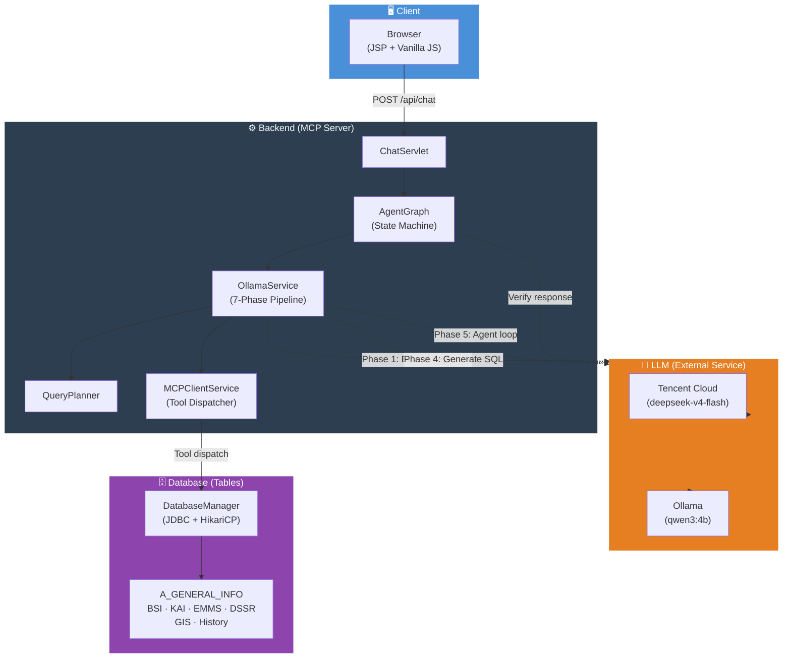

# AIS Assistant Web

A Java web application that lets users ask questions about location data through a chat interface. The app uses a Servlet/JSP frontend, a SQL Server database, an LLM agent (Tencent Cloud or Ollama) that can call tools to search location records, and a **LangGraph-style verification graph** that validates every LLM response before it reaches the user.

This repository's documentation is split into three files:

- **README.md** (this file) — project overview, tech stack, and system architecture.
- **[UserGuide.md](UserGuide.md)** — features, prerequisites, running the app, and sample prompts/interactions for end users.
- **[DevGuide.md](DevGuide.md)** — developer guide, verification graph internals, API endpoints, SQL inspection, capability changelog, debugging/testing tools, and known issues & fixes.

## Table of contents

- [Overview](#overview)
- [Tech stack](#tech-stack)
- [Architecture](#architecture)
  - [Request flow](#request-flow)
  - [Key insight: LLM position](#key-insight-llm-position)
- [Further reading](#further-reading)

---

## Overview

A Java 8 webapp packaged as a WAR and deployed to Tomcat 9. It provides:

- a chat UI for location lookup,
- fast prompt buttons auto-generated from registered tool definitions,
- exact location code search with fallback name lookup,
- partial location and district name search,
- natural language prompt detection for conversational and multi-step queries,
- optional location/district filtering for department, monument, historic building, and PSM searches,
- report availability checks across multiple locations with clickable links, rendered as sortable and filterable HTML tables (`<table class='data-table'>`) for seamless UI widget integration,
- direct report viewing links for BSI/CSR/KAI/EMMS/DSSR and slope-specific report collections,
- department/monument/historic-building/code-history lookup support,
- session memory for follow-up queries such as "which have BSI report",
- deterministic query planning with keyword extraction, pre-validation checks, multi-report expansion, and fast paths,
- **LLM-generated ordered execution plans** (`plan` array with priorities and generic relations: `independent`, `filter_previous`, `enrich_previous`, `use_previous_codes`) for any tool combination,
- **a Regex Template Gateway** for 0ms zero-LLM fast-path execution on standard UI button clicks, with natural language filter guards that automatically hand complex phrasing over to LLM semantic reasoning,
- a tool dispatch table plus UI metadata for dynamic quick prompt generation,
- centralized 3-tier configuration resolution (`AppConfig`) ensuring consistent property overrides across servlets, services, and verifier model routing,
- LLM-driven tool calls via Tencent Cloud API (OpenAI-compatible) or Ollama when needed, with increased token headroom and disambiguation rules for chain-of-thought reasoning models,
- dynamic T-SQL query generation for cross-table and attribute queries with fully dynamic HTML table rendering and accurate row-count displays,
- **a LangGraph-style multi-node verification graph that validates every LLM response before it is shown to the user**,
- clickable location code links in result tables that open the AIS Asset Search detail page,
- database schema inspection and refresh support,
- **free-text row-limit control** (`"top 50"` / `"first 20"`) and **scalable LLM-driven placeholder-record exclusion** (`"with address not null"`, `"real address"`, `"valid name"`, `"with address not undefined"`) across every list-returning tool (PSM, department, monument, historic building, name search), seamlessly propagated across execution steps without brittle regex trapping,
- clean lifecycle shutdown hooks (`ServletContextListener`) for graceful connection pool and worker thread teardown during webapp reloads.

---

## Tech stack

| Layer | Technology |
|---|---|
| Language | Java 8 |
| Build | Apache Maven 3.8+ |
| Web container | Apache Tomcat 9 |
| Servlet API | Java EE Servlet 4.0 / JSP 2.3 |
| Frontend | JSP + Vanilla JavaScript (no framework) |
| Database | Microsoft SQL Server (via JDBC) |
| Connection pool | HikariCP 4.x |
| HTTP client | OkHttp 4.x (Ollama + Tencent Cloud API calls) |
| AI / LLM (primary) | Tencent Cloud LLM API (`lkeap`, OpenAI-compatible) |
| AI / LLM (fallback) | Ollama (local, tool-calling mode) |
| Agent graph | Custom Java LangGraph-style state machine |
| JSON | Jackson (ObjectMapper) |
| Logging | SLF4J + Logback |

> No Spring, no Hibernate, no frontend framework. This is a plain Java EE / vanilla web app.

---

## Architecture

The system follows a layered architecture where the LLM operates as a **reasoning layer** between the backend orchestration and the data retrieval layer. The LLM is never "in" the MCP chain — it is a parallel external service called by the backend at specific phases.



### Request flow

```
Browser → POST /api/chat → ChatServlet
    → AgentGraph.invoke(GraphState)
        → PlannerNode (detect intent)
        → PrimaryLlmNode → OllamaService.invoke()
            ├── Phase 1: extractKeywords() ──► LLM ──► ExtractedKeywords
            ├── Phase 2: QueryPlanner.analyse() ──► Plan (ordered steps)
            ├── Phase 3: executePlan() ──► MCPClient.callTool() ──► DB
            ├── Phase 4: generateAndExecuteSql() ──► LLM ──► SQL ──► DB
            ├── Phase 5: runAgentLoop() ──► LLM ──► tool calls ──► DB
            └── Phase 6: isEmptyResult? → fallback
        → VerifierNode ──► LLM ──► APPROVED / RETRY
        → FormatterNode → HTML response → Browser
```

### Key insight: LLM position

The LLM is **not between MCPClient and DatabaseManager**. It is a parallel external service called by `OllamaService` for:

| Call site | Purpose |
|---|---|
| Phase 1 | Extract keywords/intents from user prompt |
| Phase 4 | Generate SQL when tools return empty results |
| Phase 5 | Multi-turn agent reasoning and tool selection |
| Verifier | Validate the response answers the question |

The MCPClient (tool dispatcher) and DatabaseManager execute queries **without any LLM involvement**. The LLM only decides *which* tools to call and *what* SQL to generate — the actual data retrieval is deterministic.

---

## Further reading

- For running the app, feature list, and sample prompts, see **[UserGuide.md](UserGuide.md)**.
- For internals, the verification graph, API endpoints, SQL inspection, debugging/testing tools, capability history, and known issues, see **[DevGuide.md](DevGuide.md)**.
