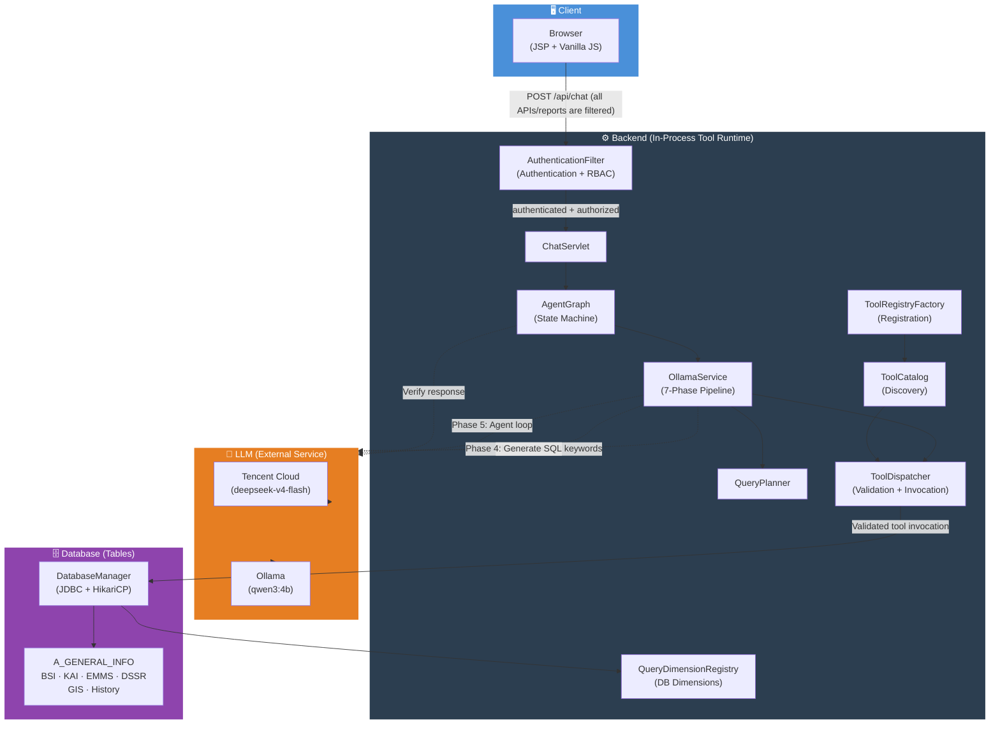

# AIS Assistant Web

A Java web application that lets users ask questions about location data through a chat interface. The app uses a Servlet/JSP frontend, a SQL Server database, an LLM agent (Tencent Cloud or Ollama) that can call tools to search location records, and a **LangGraph-style verification graph** that validates every LLM response before it reaches the user.

This repository's documentation is split into three files:

- **README.md** (this file) — project overview, tech stack, and system architecture.
- **[UserGuide.md](UserGuide.md)** — features, prerequisites, running the app, and sample prompts/interactions for end users.
- **[DevGuide.md](DevGuide.md)** — developer guide, verification graph internals, API endpoints, SQL inspection, capability changelog, debugging/testing tools, and known issues & fixes.

## Table of contents

- [Overview](#overview)
- [Tech stack](#tech-stack)
- [Architecture](#architecture)
  - [Request flow](#request-flow)
  - [Key insight: LLM and tool-runtime boundaries](#key-insight-llm-and-tool-runtime-boundaries)
  - [In-process MCP scope](#in-process-mcp-scope)
  - [Catalog-driven tool extension](#catalog-driven-tool-extension)
  - [Database-side composition](#database-side-composition)
- [Authentication and access control](#authentication-and-access-control)
- [Further reading](#further-reading)

---

## Overview

A Java 8 webapp packaged as a WAR and deployed to Tomcat 9. It provides:

- a chat UI for location lookup,
- fast prompt buttons auto-generated from registered tool definitions,
- exact location code search with fallback name lookup,
- partial location and district name search,
- natural language prompt detection for conversational and multi-step queries,
- optional location/district filtering for department, monument, historic building, and PSM searches,
- report availability checks across multiple locations with clickable links, rendered as sortable and filterable HTML tables (`<table class='data-table'>`) for seamless UI widget integration; registered report types, comma-separated requests, and the virtual `ALL` aggregate are normalized through `ReportTypeRegistry`,
- a generic `location_query` path that composes canonical filters such as department, PSM, historic grade, monument status, location, and required reports into one database-side query when the dimensions are compatible,
- direct report viewing links for BSI/CSR/KAI/EMMS/DSSR and slope-specific report collections,
- department/monument/historic-building/code-history lookup support,
- session memory for follow-up queries such as "which have BSI report",
- deterministic query planning with keyword extraction, pre-validation checks, multi-report expansion, and fast paths,
- a shared catalog-driven tool registry (`ToolDefinition` + `ToolProvider`) used by planning, agent tool discovery, argument validation, UI metadata, and execution,
- **LLM-generated ordered execution plans** (`plan` array with priorities and generic relations: `independent`, `filter_previous`, `enrich_previous`, `use_previous_codes`) for any registered tool combination,
- structured keyword extraction and catalog-backed plan validation rather than adding a semantic prompt-regex rule for each new tool or filter,
- a tool dispatch table plus UI metadata for dynamic quick prompt generation,
- centralized 3-tier configuration resolution (`AppConfig`) ensuring consistent property overrides across servlets, services, and verifier model routing,
- LLM-driven tool calls via Tencent Cloud API (OpenAI-compatible) or Ollama when needed, with structured keyword extraction, catalog validation, and disambiguation for chain-of-thought reasoning models,
- dynamic T-SQL query generation for cross-table and attribute queries with fully dynamic HTML table rendering and accurate row-count displays,
- **a LangGraph-style multi-node verification graph that validates every LLM response before it is shown to the user**,
- clickable location code links in result tables that open the AIS Asset Search detail page,
- administrator-only database schema inspection and refresh support (`AIS_ADMIN` required),
- **free-text row-limit control** (`"top 50"` / `"first 20"`) and **scalable LLM-driven placeholder-record exclusion** (`"with address not null"`, `"real address"`, `"valid name"`, `"with address not undefined"`) across every list-returning tool (PSM, department, monument, historic building, name search), seamlessly propagated across execution steps without brittle regex trapping,
- clean lifecycle shutdown hooks (`ServletContextListener`) for graceful connection pool and worker thread teardown during webapp reloads,
- a fail-closed servlet authentication/RBAC layer for `/api/*` and `/report/*`, using `AIS_USER` for normal access and `AIS_ADMIN` for database-schema access. Local development uses Tomcat BASIC authentication; production should use an enterprise Realm/SSO. `LocationServlet` repeats the `AIS_ADMIN` check for both schema methods as defense in depth.
- final-answer HTML sanitization in `ChatServlet` using an OWASP Java HTML Sanitizer allowlist before JSON serialization; the Java 8-compatible dependency must be declared in `pom.xml` and included in the WAR.

---


## Latest validated behavior (July 2026)

- Compatible filters are composed before execution. A live `PSM/CENTRAL + historic + BSI + KAI` request produced one `location_query` with `psm=CENTRAL`, `grade=ALL`, and `reportType=BSI,KAI`; the database portion completed in roughly 306 ms and returned eight matching locations.
- The planner preserves a valid canonical filter prefix when an LLM appends an unavailable singular detail projection. Multi-code results are never silently reduced to the first code for a singular tool.
- Multi-report checks return both a standard matching `results` list and grouped `checks`; the formatter renders one availability section per registered report type with report links.
- Graph accounting separates targeted repairs from full regenerations. Repair uses the shared catalog/dispatcher and returns through the verifier before formatting. Additional verified data from repair calls is formatted into native, collapsible HTML tables, hiding raw JSON and preserving vertical screen space. Database timeouts are structured non-success results and do not trigger the same SQL strategy repeatedly.
- Multi-location detail answers use a single sticky map area with location-code tabs. The map plugin displays the received code and replaces failed iframes with a clear status message.
- ArcGIS deployment note: the currently tested internal host responds on HTTP port 80 with authentication required (`401`), while HTTPS port 443 is unavailable. Use approved integrated authentication plus CORS or a constrained same-origin reverse proxy; never place ArcGIS credentials/tokens in static JavaScript.
- Security has been enabled by default (`security.enabled=true`) and fully validated. Endpoint RBAC tests for anonymous (`401`), user (`200` / allowed), user schema (`403` / forbidden), and admin schema access (`200` / allowed) have been successfully verified and are live.

## Tech stack

| Layer | Technology |
|---|---|
| Language | Java 8 |
| Build | Apache Maven 3.8+ |
| Web container | Apache Tomcat 9 |
| Servlet API | Java EE Servlet 4.0 / JSP 2.3 |
| Authentication / RBAC | `AuthenticationFilter` + Tomcat Realm/enterprise SSO (`AIS_USER`, `AIS_ADMIN`) |
| Output sanitization | OWASP Java HTML Sanitizer allowlist in `ChatServlet` |
| Frontend | JSP + Vanilla JavaScript (no framework) |
| Database | Microsoft SQL Server (via JDBC) |
| Connection pool | HikariCP 4.x |
| HTTP client | OkHttp 4.x (Ollama + Tencent Cloud API calls) |
| AI / LLM (primary) | Tencent Cloud LLM API (`lkeap`, OpenAI-compatible) |
| AI / LLM (fallback) | Ollama (local, tool-calling mode) |
| Agent graph | Custom Java LangGraph-style state machine |
| JSON | Jackson (ObjectMapper) |
| Logging | SLF4J + Logback |

> No Spring, no Hibernate, no frontend framework. This is a plain Java EE / vanilla web app.

---

## Architecture

The system follows a layered architecture where the LLM operates as a **reasoning layer** between the backend orchestration and the data retrieval layer. The LLM is not part of the in-process tool runtime; it is a parallel external service called by the backend at specific phases.



### Request flow

```
Browser → /api/* or /report/* → AuthenticationFilter
    ├── no trusted principal → 401 (no servlet/LLM/tool/DB work)
    ├── authenticated but wrong role → 403
    └── authorized → ChatServlet / ToolsServlet / LocationServlet / ReportServlet
        → AgentGraph.invoke(GraphState)
        → PlannerNode (detect intent)
        → PrimaryLlmNode → OllamaService.invoke()
            ├── Phase 1: extractKeywords() ──► LLM ──► ExtractedKeywords
            ├── Phase 2: QueryPlanner.analyse() ──► Plan (ordered steps)
            ├── Phase 3: executePlan() ──► ToolDispatcher.callTool() ──► DatabaseManager
            │                    └── compatible plans ──► location_query ──► QueryDimensionRegistry
            ├── Phase 4: generateAndExecuteSql() ──► LLM ──► SQL ──► DB
            ├── Phase 5: runAgentLoop() ──► LLM ──► tool calls ──► DB
            └── Phase 6: isEmptyResult? → fallback
        → VerifierNode ──► LLM ──► APPROVED / RETRY + repair feedback
            ├── targeted repair → PatchNode → catalog-validated tool call → VerifierNode
            └── ordinary retry → PrimaryLlmNode
        → FormatterNode → HTML response → Browser
```

### Key insight: LLM and tool-runtime boundaries

The LLM is **not between the tool runtime and `DatabaseManager`**. It is a parallel external service called by `OllamaService` for:

| Call site | Purpose |
|---|---|
| Phase 1 | Extract keywords/intents from user prompt |
| Phase 4 | Generate SQL when tools return empty results |
| Phase 5 | Multi-turn agent reasoning and tool selection |
| Verifier | Validate the response answers the question |

`ToolCatalog`, `ToolDispatcher`, the registered providers, and `DatabaseManager` execute queries **without any LLM involvement**. The LLM only decides *which* tools to call and *what* SQL to generate — the actual data retrieval is deterministic.

### In-process MCP scope

The application currently uses an in-process catalog and dispatcher. `MCPClientService` remains a compatibility facade for existing callers; it is not a standalone MCP protocol server. This is intentional for the current single-WAR deployment: a separate MCP server process is only needed if external clients, independent deployment/scaling, process isolation, or official MCP transport compliance becomes a requirement.

### Catalog-driven tool extension

New tools are registered through `ToolRegistryFactory`, not by adding execution branches to `OllamaService`. The current implementation keeps the anonymous executors together in that factory; separate provider classes are optional. `MCPClientService` is a compatibility facade over the catalog and dispatcher. Each registration supplies:

- a unique tool name,
- intent types and aliases,
- required and accepted parameters,
- supported relations,
- produced fields,
- consumed fields when the tool accepts previous location codes,
- an LLM JSON-schema description,
- optional UI metadata, and
- the deterministic executor.

A typical tool-registration flow is:

```text
ToolRegistryFactory.registerTools()
        ↓
ToolRegistration + ToolDefinition + JSON schema
        ↓
ToolCatalog
        ├── listTools() → agent loop / Ollama
        ├── resolveDefinition() → QueryPlanner
        └── getAcceptedParameters() → OllamaService
        ↓
ToolDispatcher.callTool()
        ↓
ToolProvider executor → DatabaseManager
```

For a tool using `use_previous_codes`, its metadata must declare `LOC_CD` in `consumedFields` and accept either `locCds` or `locCd`. Tools returning location candidates should expose a standard response such as `{ "count": N, "results": [{ "LOC_CD": "..." }] }` so generic filtering, enrichment, session memory, and rendering work without tool-specific branches.

The catalog makes a new tool automatically visible to the agent loop and `/api/tools`. If the tool must also be selected by the keyword-extraction fast path, add its intent/alias and semantic guidance to the planner/catalog prompt or make the keyword prompt catalog-generated. Database-backed tools still require their database/service implementation and tests.

### Database-side composition

Compatible location filters are represented as canonical dimensions rather than a list of tool-specific combinations:

```text
PlanOptimizer
    → canonical parameters
    → location_query
    → DatabaseManager Map adapter
    → QueryDimensionRegistry
    → trusted QueryPredicate objects
    → existing LocationQuery SQL builder
```

The current dimensions include location name/area, PSM, department, location codes, historic grade, monument status, and required report types. `ReportTypeRegistry` supplies the trusted table and identifier-column metadata, normalizes one report, comma-separated reports, and `ALL`, and exposes `getTableName()` / `getIdColumn()` for the database layer. The database layer owns SQL generation; `OllamaService` and `QueryPlanner` do not contain a branch for every filter combination.

The project targets Java 8. Use explicit Java 8-compatible collection code; do not use `Map.of`, `List.copyOf`, `String.isBlank`, `Stream.toList`, or `Collectors.toUnmodifiableList`. HTML values are escaped once at the field boundary to avoid double-encoded output such as `&amp;amp;`.

If a query cannot be represented by the canonical dimensions, the generic multi-step relation path remains available as a fallback. Adding a new tool that uses existing dimensions does not require changes to `OllamaService`, `QueryPlanner`, or `Intent`.

---

## Authentication and access control

The authentication package is created under:

```text
src/main/java/com/ais/security/
├── AuthenticationFilter.java
├── AuthorizationContext.java
└── SecurityGuards.java
```

`WEB-INF/web.xml` maps `AuthenticationFilter` to `/api/*` and `/report/*`. The filter calls the servlet container's authentication mechanism and then applies this role policy:

| Route | Required role |
|---|---|
| `/api/chat`, `/api/tools` | `AIS_USER` or `AIS_ADMIN` |
| `/api/location/general-info` | `AIS_USER` or `AIS_ADMIN` |
| `/api/location/schema` | `AIS_ADMIN` |
| `/report/*` | `AIS_USER` or `AIS_ADMIN` |

For local development, `web.xml` uses BASIC authentication and Tomcat's active user database at `$CATALINA_BASE/conf/tomcat-users.xml` (Windows: `%CATALINA_BASE%\conf\tomcat-users.xml`). Eclipse WTP often uses a separate server configuration under the workspace, so always read the `Using CATALINA_BASE` path from the Tomcat startup console before editing credentials.

A repeated browser login prompt together with `curl` returning `401` means Tomcat rejected the identity/password; it is not an AIS role failure. Verify the active `tomcat-users.xml`, the `UserDatabaseRealm` in `server.xml`, the exact case-sensitive role names, and perform a full Tomcat restart. A valid identity with the wrong role returns `403` instead.

Local smoke test:

```bash
curl -i -u 'ais-user:YOUR_LOCAL_PASSWORD' \
  http://localhost:8090/ais_ai/api/tools
```

BASIC authentication is for local development only and must run over HTTPS. Production deployments should use corporate SSO/LDAP/OIDC or another trusted Tomcat Realm. Never place production passwords, API keys, session IDs, or authorization headers in source control or logs.

**Current integration status:** authentication/RBAC is operational in the deployed environment. The filter protects `/api/*` and `/report/*`; `AIS_USER` receives `403` from `/api/location/schema`, while `AIS_ADMIN` is allowed. `LocationServlet` repeats the admin check for both GET and POST. `ChatServlet` sanitizes the final HTML answer before returning JSON. The Java 8 OWASP dependency is resolved and compilation is clean. Keep the `401`/`403`/allowed-path and browser XSS regression tests.

The remaining authorization work is data-level policy: row/department and column restrictions for SQL fallback must still be enforced in deterministic database code using the server-derived `AuthorizationContext`.

---

## Further reading

- For running the app, feature list, and sample prompts, see **[UserGuide.md](UserGuide.md)**.
- For internals, the verification graph, API endpoints, SQL inspection, debugging/testing tools, capability history, and known issues, see **[DevGuide.md](DevGuide.md)**.
